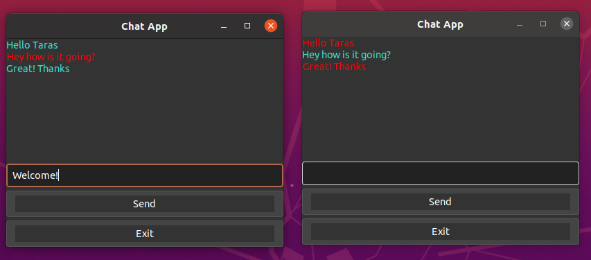

## Duo Peer Chat in C

This is a messenger application that handles a connection between 2 clients 

Utilizing Sockets for networking, Threads for concurrency, and Gtk library for GUI 

Implemented linked list data structure for message queueing

### To run:

`make`

`./chat [local port number] [remote machine name] [remote port number]`

## Implementation Notes

### COMPLETED:

Custom list data structure

Testing for data structure ensuring no memory leaks

UDP connection netcode

Concurrency Threading

Basic GUI

### TO DO: 

upgrade cypher encryption to rsa

